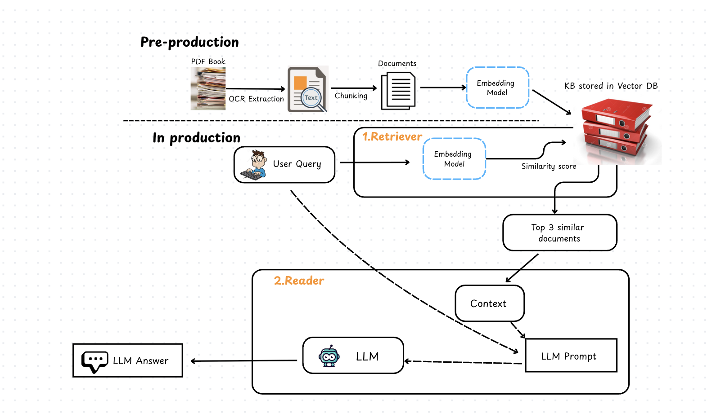

# Islamic Fiqh Rag

This projects aimes to retrieve islamic Fiqh answers from an islamic dataset and use Qwen-max to generate the answer

## Requirements 
- Python 3.10 or later 


## Installation
### Install the reqired packages
```bash
$ pip install -r requirements.txt
```

### For installing Arabic Language in tessdata 
On Windows :
1) Download and install Arabic from [here](https://github.com/tesseract-ocr/tessdata/blob/main/ara.traineddata)
2) Place it into tessdata folder (e.g., C:\Program Files\Tesseract-OCR\tessdata)

# Creating RAG system 


## Data
* I used a book name "ما لا يسع المسلم جهله " for retreiving.
* Then because the book in the form of PDF I converted it to a text.
* One problem I faced that to extract the text from the book I should used OCR that's why I used tessdata.
* Also, because the book contain Qura'an sentences with dicritics, sometimes when converting this using OCR I got wrong sentences.
* To solve this problem I wrote in the prompt to not include Qur'an answer in the generating.
* To convert your dataset, after running the code the all splits will be saved in order to load it again without rerunning the code
```bash
python handlingData.py
```
## Evaluation Dataset Generation

To create an evaluation dataset, I followed Hugging Face's guidance on automatically generating evaluation questions, as described in [this tutorial](https://huggingface.co/learn/cookbook/rag_evaluation). I also incorporated techniques from the **ReST meets ReAct: Self-Improvement for Multi-Step Reasoning LLM Agent** paper to improve and expand the dataset. Below are the steps I followed:

### 1. Automatic Question Generation  
- Generated **200 evaluation questions** using the models **Qwen3-8B** and **Qwen-Plus**.

### 2. Setup of Critique Agents  
- Used the same models (**Qwen3-8B** & **Qwen-Plus**) as **critique agents** to assess the quality of the generated questions.
- Each question was scored on a **scale from 1 to 5** based on the following three criteria:
  - **Groundedness**: Can the question be answered using the provided context?
  - **Relevance**: Is the question meaningful and useful to the end user?  
    *Example: "How useful is this question for a Muslim user?"*
  - **Stand-Alone Clarity**: Is the question understandable without needing to refer back to context, assuming the user has domain knowledge or access to the internet?


### 3. Filtering and Selection  
- Retained questions **only if all criterion scores exceeded a predefined threshold**.

### 4. Final Dataset Construction  
- Constructed a **hybrid evaluation dataset** by combining:
  - Filtered, automatically generated questions from both models.
  - Manually curated and labeled question samples.

## LLM judge and tackiling sensitivity problem
1) For more information about using LLM as a judge from [here](https://www.evidentlyai.com/llm-guide/llm-as-a-judge)


